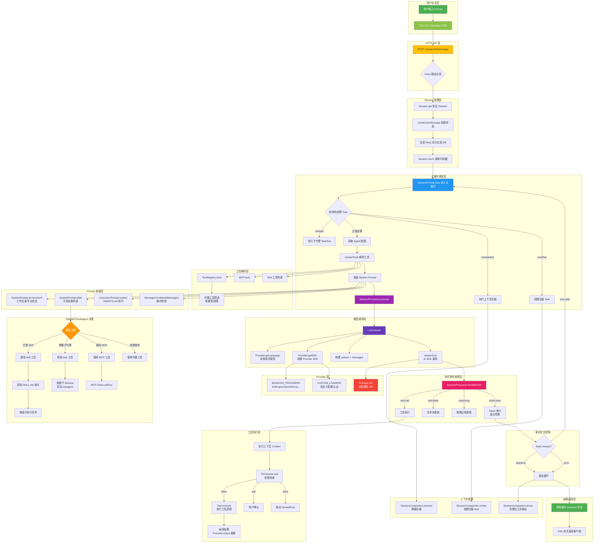
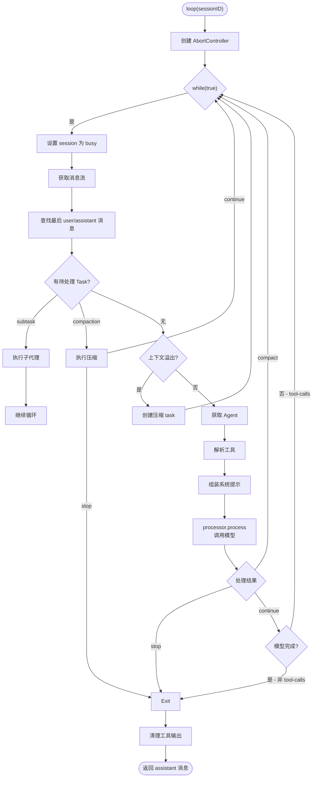

# OpenCode 系统工作流程完整说明文档

> 本文档详细描述了 OpenCode 从接收用户 Prompt 到最终返回结果的完整工作流程。

---

## 目录

1. [总体架构概览](#1-总体架构概览)
2. [详细流程步骤说明](#2-详细流程步骤说明)
   - [阶段一：用户请求接收与 Session 管理](#21-阶段一用户请求接收与-session-管理)
   - [阶段二：Prompt 处理与消息创建](#22-阶段二prompt-处理与消息创建)
   - [阶段三：主循环调度](#23-阶段三主循环调度)
   - [阶段四：工具解析与系统提示组装](#24-阶段四工具解析与系统提示组装)
   - [阶段五：模型调用与流式处理](#25-阶段五模型调用与流式处理)
   - [阶段六：工具执行与结果反馈](#26-阶段六工具执行与结果反馈)
   - [阶段七：多轮交互与循环控制](#27-阶段七多轮交互与循环控制)
   - [阶段八：结果返回与上下文管理](#28-阶段八结果返回与上下文管理)
3. [Skill / MCP / Subagent 调用决策机制](#3-skill--mcp--subagent-调用决策机制)
   - [3.1 Skill 调用决策](#31-skill-调用决策)
   - [3.2 Subagent 调用决策](#32-subagent-调用决策)
   - [3.3 MCP 工具调用](#33-mcp-工具调用)
4. [关键代码模块与文件说明](#4-关键代码模块与文件说明)
5. [完整流程图](#5-完整流程图)
6. [附录：数据格式参考](#6-附录数据格式参考)

---

## 1. 总体架构概览

OpenCode 采用 **客户端-服务器** 架构，核心处理流程可划分为以下层级：

```
┌─────────────────────────────────────────────────────────┐
│                    用户交互层 (TUI/CLI/Desktop)          │
├─────────────────────────────────────────────────────────┤
│                    HTTP API 层 (Hono Server)             │
├─────────────────────────────────────────────────────────┤
│              Session 管理层 & 消息持久化                  │
├─────────────────────────────────────────────────────────┤
│              主循环调度层 (SessionPrompt.loop)           │
├─────────────────────────────────────────────────────────┤
│    工具注册表    系统提示组装    Provider/Auth 管理        │
├─────────────────────────────────────────────────────────┤
│              LLM 调用层 (AI SDK streamText)              │
├─────────────────────────────────────────────────────────┤
│             流式事件处理 (SessionProcessor)              │
└─────────────────────────────────────────────────────────┘
```

---

## 2. 详细流程步骤说明

### 2.1 阶段一：用户请求接收与 Session 管理

#### 触发条件

用户通过以下任一方式发送消息：

- **TUI 终端界面**：在输入框输入文本后提交
- **CLI 命令行**：执行 `opencode run "message"` 命令
- **Desktop 桌面应用**：通过 HTTP API 调用
- **SDK 客户端**：通过 `@opencode-ai/sdk` 调用

#### 处理逻辑

**入口（服务器层）**：

```
POST /:sessionID/message
```

文件：`packages/opencode/src/server/routes/session.ts`（第 783-823 行）

```typescript
// 简化的路由处理
.post("/:sessionID/message", async (c) => {
  return stream(c, async (stream) => {
    const msg = await SessionPrompt.prompt({ ...body, sessionID })
    stream.write(JSON.stringify(msg))
  })
})
```

**Session 创建或获取**：

文件：`packages/opencode/src/session/index.ts`（第 509-522 行）

```typescript
// Session.create - 创建一个新的会话
const create = Effect.fn("Session.create")(function* (input) {
  return yield* createNext({
    parentID: input?.parentID,
    directory: Instance.directory,
    title: input?.title,
    permission: input?.permission,
  })
})
```

Session 的数据结构：

| 字段 | 类型 | 说明 |
|---|---|---|
| `id` | `SessionID` | 唯一标识符（时间戳降序） |
| `slug` | `string` | 简短可读 ID |
| `projectID` | `ProjectID` | 所属项目 |
| `directory` | `string` | 工作目录路径 |
| `parentID` | `SessionID?` | 父 Session（用于 fork） |
| `title` | `string` | 会话标题 |
| `permission` | `Ruleset` | 权限规则集 |
| `time` | `{created, updated}` | 时间戳 |

#### 数据流转

```
用户输入文本 + 附件
        │
        ▼
HTTP POST /:sessionID/message
        │
        ▼
SessionPrompt.prompt(input)
        │
        ├── Session.get(sessionID) → 获取/验证 session
        ├── SessionRevert.cleanup() → 清理回滚状态
        ├── createUserMessage() → 持久化用户消息
        └── loop({ sessionID }) → 进入主循环
```

#### 关键判断节点

- **Session 是否繁忙**：`SessionPrompt.assertNotBusy()` 确保同一 Session 不会并发处理
- **noReply 标记**：如果 `input.noReply === true`，则只创建用户消息，不进入 loop
- **权限合并**：用户消息中的 `tools` 参数会合并到 Session 的权限规则集中

---

### 2.2 阶段二：Prompt 处理与消息创建

#### 触发条件

`SessionPrompt.prompt()` 被调用后（文件：`prompt.ts` 第 162-189 行）。

#### 处理逻辑

**createUserMessage 函数**（文件：`prompt.ts` 第 993-1394 行）：

该函数负责将用户输入的 parts 转换为内部消息格式并持久化。

```typescript
async function createUserMessage(input) {
  // 1. 确定使用的 agent（默认 agent 或 @agent 指定的 agent）
  // 2. 确定使用的 model（上次使用的或默认的）
  // 3. 逐一处理 input.parts 中的每个 part
  //     - text part: 直接存储
  //     - file part: 读取文件内容（支持 data:/file: 协议）
  //     - agent part: @agent 语法，添加合成文本指令
  //     - mcp resource: 通过 MCP 协议读取资源
  // 4. 创建 MessageV2.User 消息
  // 5. 持久化消息及其 parts 到数据库
}
```

**消息与 Part 的持久化**：

文件：`packages/opencode/src/session/message-v2.ts`

每条消息由 `Message`+`Part` 两种表构成：

```
Message (session_id, id, role, agent, model, cost, tokens, ...)
  └── Part (message_id, id, type, data...)
      ├── TextPart: { type: "text", text: string }
      ├── FilePart: { type: "file", url: string, mime: string }
      ├── ToolPart: { type: "tool", tool: string, state: ToolState }
      ├── ReasoningPart: { type: "reasoning", text: string }
      ├── AgentPart: { type: "agent", name: string }
      ├── SubtaskPart: { type: "subtask", agent, prompt, ... }
      └── CompactionPart: { type: "compaction", auto, overflow }
```

#### 输入输出

**输入**（`PromptInput`）：

```typescript
{
  sessionID: SessionID,
  messageID?: MessageID,
  model?: { providerID, modelID },
  agent?: string,
  noReply?: boolean,
  tools?: Record<string, boolean>,
  variant?: string,
  parts: Array<{ type: "text", text } | { type: "file", url, mime } | ...>
}
```

**输出**：`MessageV2.WithParts`（已持久化的用户消息 + 所有 parts）

---

### 2.3 阶段三：主循环调度

#### 触发条件

`SessionPrompt.prompt()` 调用 `loop({ sessionID })`。

#### 核心实现

文件：`packages/opencode/src/session/prompt.ts`（第 278-762 行）

```typescript
export const loop = fn(LoopInput, async (input) => {
  const abort = start(sessionID)  // 创建新的 AbortController

  await using _ = defer(() => cancel(sessionID))

  while (true) {
    await SessionStatus.set(sessionID, { type: "busy" })
    if (abort.aborted) break

    // 1. 获取消息流（已压缩的视图）
    let msgs = await MessageV2.filterCompacted(MessageV2.stream(sessionID))

    // 2. 找到最后一条 user/assistant/finished 消息
    let lastUser, lastAssistant, lastFinished

    // 3. 检查是否有待处理的 subtask 或 compaction
    const task = tasks.pop()

    // 4. 处理 subtask（子代理任务）→ 见下
    // 5. 处理 compaction（上下文压缩）→ 见下
    // 6. 检查上下文溢出 → 创建 compaction

    // 7. 正常处理流程
    const agent = await Agent.get(lastUser.agent)
    const processor = await SessionProcessor.create({ ... })
    const tools = await resolveTools({ ... })
    const system = [ ...SystemPrompt.environment, ...skills, ...instructions ]

    const result = await processor.process({
      user: lastUser, agent, system, tools, messages, ...
    })

    // 8. 根据结果决定继续或退出
    if (structuredOutput !== undefined) break    // JSON 格式输出完成
    if (modelFinished && !error) break            // 模型完成（非 tool-calls）
    if (result === "stop") break
    if (result === "compact") continue            // 压缩后继续
  }

  // 9. 返回最终 assistant 消息
  return lastAssistant
})
```

#### 退出条件

主循环在以下任一条件满足时退出：

| 条件 | 说明 |
|---|---|
| `lastAssistant.finish` 不是 `"tool-calls"` | 模型不再需要调用工具 |
| `structuredOutput !== undefined` | JSON 结构输出完成 |
| `processor.process()` 返回 `"stop"` | 被阻塞、出错或中止 |
| `abort.aborted` | 用户取消或超时 |

---

### 2.4 阶段四：工具解析与系统提示组装

#### 触发条件

每次主循环迭代中，在调用模型之前。

#### 工具解析（resolveTools）

文件：`prompt.ts`（第 772-961 行）

```typescript
export async function resolveTools(input) {
  const tools: Record<string, AITool> = {}

  // 1. 从 ToolRegistry 获取所有可用工具
  for (const item of await ToolRegistry.tools(model, agent)) {
    const schema = ProviderTransform.schema(model, item.parameters)

    // 2. 包装为 AI SDK tool() 格式
    tools[item.id] = tool({
      description: item.description,
      inputSchema: jsonSchema(schema),
      async execute(args, options) {
        // 触发 before/after 插件钩子
        const result = await item.execute(args, ctx)
        return result
      },
    })
  }

  // 3. 添加 MCP 工具（来自各个 MCP 服务器）
  for (const [key, item] of Object.entries(await MCP.tools())) {
    tools[key] = wrapMcpTool(item)
  }

  // 4. 添加结构化输出工具（JSON schema 模式）
  if (lastUser.format?.type === "json_schema") {
    tools["StructuredOutput"] = createStructuredOutputTool({ ... })
  }

  return tools
}
```

**工具注册表**（文件：`packages/opencode/src/tool/registry.ts`）：

```typescript
// 第 114-139 行：所有内置工具
[
  InvalidTool, QuestionTool, BashTool, ReadTool, GlobTool,
  GrepTool, EditTool, WriteTool, TaskTool, WebFetchTool,
  TodoWriteTool, WebSearchTool, CodeSearchTool, SkillTool,
  ApplyPatchTool, LspTool, BatchTool, PlanExitTool,
  ...customTools,  // 从 tool/ 目录加载的自定义工具
]
```

**工具筛选逻辑**（registry.ts 第 157-194 行）：

- 📋 `codesearch` / `websearch`：仅当 provider 为 opencode 或开启了 Flag
- ✏️ `apply_patch`：仅用于特定 GPT 模型（GPT-5+）
- 🚫 被 agent 权限 deny 的工具会被过滤
- ⚙️ `edit` / `write`：在 apply_patch 启用时被禁用

#### 系统提示组装

```typescript
// prompt.ts 第 682-691 行
const skills = await SystemPrompt.skills(agent)
const system = [
  ...(await SystemPrompt.environment(model)),  // 环境信息
  ...(skills ? [skills] : []),                 // 可用技能列表
  ...(await InstructionPrompt.system()),        // AGENTS.md 等指令文件
]
```

**SystemPrompt.environment**（文件：`system.ts` 第 34-59 行）：

注入的内容包括：
- 模型名称和 ID
- 工作目录和项目根路径
- Git 仓库状态
- 操作系统平台
- 当前日期

**SystemPrompt.skills**（文件：`system.ts` 第 61-73 行）：

- 调用 `Skill.available(agent)` 列出所有对当前 agent 可用的 skill
- 格式化为 XML 样式呈现给模型（含 name、description、location）

**InstructionPrompt.system**（文件：`instruction.ts`）：

- 从 `AGENTS.md`、`CLAUDE.md` 等文件中读取项目级和全局级指令
- 还支持从 URL 加载远程指令文件

#### 输入输出

```
输入：
  - Agent.Info（当前 agent 的配置）
  - Provider.Model（当前模型信息）
  - Session.Info（当前会话权限）

输出：
  - tools: Record<string, AITool>（AI SDK 格式的工具定义）
  - system: string[]（系统提示数组）
```

---

### 2.5 阶段五：模型调用与流式处理

#### 触发条件

主循环中 `processor.process()` 被调用。

#### 模型调用（LLM.stream）

文件：`packages/opencode/src/session/llm.ts`（第 68-315 行）

```typescript
export async function stream(input: StreamInput) {
  // 1. 并行获取语言模型、配置、Provider 和认证信息
  const [language, cfg, provider, auth] = await Promise.all([
    Provider.getLanguage(input.model),
    Config.get(),
    Provider.getProvider(input.model.providerID),
    Auth.get(input.model.providerID),
  ])

  // 2. 构建系统提示（agent prompt + 自定义 system + 用户 system）
  const system = [agent.prompt || providerPrompt, ...input.system, user.system]

  // 3. 转换消息格式
  const messages = [
    { role: "system", content: system.join("\n") },
    ...input.messages,
  ]

  // 4. 配置模型参数
  const options = mergeDeep(base, model.options, agent.options, variant)

  // 5. 调用 AI SDK streamText
  return streamText({
    model: wrapLanguageModel({
      model: language,
      middleware: [{
        transformParams(args) {
          args.params.prompt = ProviderTransform.message(
            args.params.prompt, input.model, options
          )
          return args.params
        }
      }]
    }),
    messages,
    tools,
    temperature, topP, topK,
    providerOptions: ProviderTransform.providerOptions(model, options),
    toolChoice: input.toolChoice,
    abortSignal: input.abort,
  })
}
```

**Provider 层**（文件：`packages/opencode/src/provider/provider.ts`）：

```
Provider.getModel(providerID, modelID)     → 解析模型配置
Provider.getLanguage(model)                → 获取 LanguageModelV3
Provider.getSDK(model)                     → 创建 Provider SDK 实例
Provider.parseModel("anthropic/claude-4")  → 从配置字符串解析模型
```

**Provider Transform 层**（文件：`packages/opencode/src/provider/transform.ts`）：

```
ProviderTransform.schema()        → 转换工具参数 schema 适配 provider
ProviderTransform.message()       → 转换消息格式适配 provider
ProviderTransform.options()       → 构建 provider-specific options
ProviderTransform.providerOptions() → 包装为 provider 命名空间
```

#### 流式事件处理（SessionProcessor）

文件：`packages/opencode/src/session/processor.ts`（第 115-365 行）

处理器消费 `streamText` 返回的事件流，逐一处理以下事件类型：

| 事件类型 | 处理逻辑 |
|---|---|
| `start` | 设置 session 状态为 busy |
| `reasoning-start/delta/end` | 创建/更新 reasoning part 并实时推送 |
| `text-start/delta/end` | 创建/更新文本 part 并实时推送 |
| `tool-input-start/delta/end` | 创建 tool part（pending 状态） |
| `tool-call` | 将 tool part 更新为 running，检查死循环 |
| `tool-result` | 将 tool part 更新为 completed，写入输出 |
| `tool-error` | 将 tool part 更新为 error |
| `start-step` | 创建文件快照 |
| `finish-step` | 计算 token 用量、生成 diff、检查溢出 |
| `error` | 抛出异常触发重试或终止 |

#### 死循环检测（Doom Loop）

processor.ts 第 186-210 行：当同一个工具被相同参数连续调用 3 次时，触发权限询问 `doom_loop`。

#### 消息格式转换

文件：`message-v2.ts`（第 576-810 行）的 `toModelMessages()` 将内部 `MessageV2.WithParts` 格式转换为 AI SDK 的 `ModelMessage[]`：

```
MessageV2 内部格式                  AI SDK 格式
─────────────────────────────────────────────────
User TextPart          →  { role: "user", content: [{ type: "text" }] }
User FilePart (图片)    →  { role: "user", content: [{ type: "file", url, mime }] }
Assistant TextPart     →  { role: "assistant", content: [{ type: "text" }] }
Assistant ToolPart     →  { role: "assistant", content: [{ type: "tool-result", ... }] }
Assistant ReasoningPart → { role: "assistant", content: [{ type: "reasoning" }] }
CompactionPart         →  { role: "user", content: "What did we do so far?" }
```

---

### 2.6 阶段六：工具执行与结果反馈

#### 触发条件

模型返回 `tool-call` 事件时。

#### 执行流程

1. **AI SDK 调用工具**：`streamText` 收到模型返回的 tool-call 后，自动调用对应 tool 的 `execute()` 方法

2. **Tool 包装层**（`prompt.ts` 第 828-863 行）：
   ```typescript
   async execute(args, options) {
     const ctx = context(args, options)  // 创建执行上下文
     await Plugin.trigger("tool.execute.before", { tool, args })
     const result = await item.execute(args, ctx)
     await Plugin.trigger("tool.execute.after", { tool, args }, result)
     return result
   }
   ```

3. **Tool Context**（`prompt.ts` 第 784-817 行）：
   ```typescript
   const ctx: Tool.Context = {
     sessionID, messageID, callID, abort, agent,
     messages: input.messages,  // 当前会话历史
     metadata: async (val) => { /* 更新 tool part 元数据 */ },
     ask: async (req) => { /* 发起权限请求 */ },
   }
   ```

4. **执行结果返回给 AI SDK**：`execute()` 返回 `{ title, output, metadata, attachments }`

5. **AI SDK 将结果注入到消息流**：作为 tool-result 事件发送给处理器

6. **处理器更新 Part 状态**（`processor.ts` 第 213-230 行）：
   ```typescript
   case "tool-result": {
     yield* session.updatePart({
       ...match,
       state: {
         status: "completed",
         output: value.output.output,
         metadata: value.output.metadata,
         time: { start, end: Date.now() },
         attachments: value.output.attachments,
       },
     })
   }
   ```

7. **模型收到工具结果**：AI SDK 将 tool-result 作为下一轮模型调用的输入消息的一部分

#### 权限控制

工具执行前，会根据 agent 的 `permission` 规则集进行权限检查：

```typescript
// permission/index.ts
await Permission.ask({
  permission: toolName,
  patterns: ["*"],
  ruleset: Permission.merge(agent.permission, session.permission ?? []),
})
```

权限结果：
- `allow` → 直接执行
- `deny` → 抛出 `Permission.DeniedError`
- `ask` → 向用户发起询问，等待响应

#### 输出截断

工具执行结果会经过 `Truncate.output()` 处理（`tool.ts` 第 72-84 行），当输出过长时自动截断并写入文件。

---

### 2.7 阶段七：多轮交互与循环控制

#### 触发条件

工具执行完成后，AI SDK 将 tool-result 作为下一轮输入的一部分。

#### 循环判断

主循环（`prompt.ts` 第 298-751 行）在每次迭代后判断是否需要继续：

```typescript
// 判断模型是否完成（不再需要调用工具）
const modelFinished =
  processor.message.finish &&
  !["tool-calls", "unknown"].includes(processor.message.finish)

if (modelFinished && !processor.message.error) {
  if (format.type === "json_schema") {
    // JSON schema 模式下未调用 StructuredOutput → 报错
    processor.message.error = new StructuredOutputError(...)
    break
  }
  // 正常完成 → 退出循环
}

if (result === "stop") break      // 阻塞/错误/中止
if (result === "compact") continue // 需要上下文压缩
```

#### 多轮交互示意图

```
用户: "帮我写一个React组件"
  │
  ▼
[模型调用 #1] → 返回 tool-call(read)
  │
  ▼
Tool(read) 执行 → 返回结果
  │
  ▼
[模型调用 #2] → 收到 read 结果 → 返回 tool-call(edit)
  │
  ▼
Tool(edit) 执行 → 修改文件
  │
  ▼
[模型调用 #3] → 收到 edit 结果 → 返回 tool-call(bash)
  │
  ▼
Tool(bash) 执行 → 运行测试
  │
  ▼
[模型调用 #4] → 收到 bash 结果 → finish:"stop" → 生成文本回复
  │
  ▼
用户收到回复: "已完成，组件文件在 src/components/Button.tsx"
```

---

### 2.8 阶段八：结果返回与上下文管理

#### 结果返回

主循环退出后，从消息流中找到最后一条 assistant 消息返回给调用方：

```typescript
// prompt.ts 第 752-760 行
for await (const item of MessageV2.stream(sessionID)) {
  if (item.info.role === "user") continue
  const queued = state()[sessionID]?.callbacks ?? []
  for (const q of queued) { q.resolve(item) }
  return item
}
```

HTTP API 层将结果通过 SSE 流式返回给客户端。

#### 上下文压缩（Compaction）

文件：`packages/opencode/src/session/compaction.ts`

**触发条件**：
1. Token 使用量超过模型上下文限制的阈值 → `isOverflow()` 返回 true
2. 显式调用 `SessionCompaction.create()`

**压缩流程**：

```typescript
// 创建 compaction task → 插入到消息流
await SessionCompaction.create({
  sessionID,
  agent: lastUser.agent,
  model: lastUser.model,
  auto: true,
})

// 主循环下次迭代时检测到 compaction task
if (task?.type === "compaction") {
  const result = await SessionCompaction.process({
    messages: msgs, parentID, abort, sessionID, auto, overflow,
  })
  if (result === "stop") break  // 用户取消
  continue
}
```

**Prune 清理**（compaction.ts 第 86-120 行）：

在每次循环退出后执行 `SessionCompaction.prune()`，保留最近约 40K tokens 的工具输出，将更早的工具输出内容清除（只保留元数据标记为 compacted）：

```typescript
// 从后往前遍历，累计 token 估算
// 超过 PRUNE_PROTECT (40K) 的部分标记为可清理
total += Token.estimate(part.state.output)
if (total > PRUNE_PROTECT) {
  toPrune.push(part)  // 标记为待清理
}

// 受保护的工具（如 skill）不会被清理
const PRUNE_PROTECTED_TOOLS = ["skill"]
```

---

## 3. Skill / MCP / Subagent 调用决策机制

### 3.1 Skill 调用决策

#### 模型如何知道有 Skill 可用

1. **系统提示注入**（`system.ts` 第 61-73 行）：
   ```typescript
   const skills = await SystemPrompt.skills(agent)
   // 输出格式：
   // <available_skills>
   //   <skill>
   //     <name>cloudflare</name>
   //     <description>Comprehensive Cloudflare platform skill...</description>
   //     <location>file:///path/to/SKILL.md</location>
   //   </skill>
   // </available_skills>
   ```

2. **Skill 工具定义**（`skill.ts` 第 9-28 行）：
   ```
   Load a specialized skill that provides domain-specific instructions and workflows.
   
   Available Skills:
   - **cloudflare**: Comprehensive Cloudflare platform skill...
   - **agents-sdk**: Build AI agents on Cloudflare Workers...
   ```

#### 模型的决策过程

```
模型收到用户请求
  │
  ├── 检查可用技能列表（系统提示中）
  │     │
  │     └── 是否有技能描述与当前任务匹配？
  │           │
  │           ├── 是 → 调用 skill("skill-name") 工具加载技能
  │           │         │
  │           │         ▼
  │           │    skill 工具返回详细指令
  │           │    模型根据指令执行任务
  │           │
  │           └── 否 → 使用常规工具完成任务
```

#### Skill 加载流程

```typescript
// SkillTool.execute() - skill.ts 第 43-103 行
const skill = await Skill.get(params.name)

// 返回 skill 内容和目录结构
return {
  output: [
    `<skill_content name="${skill.name}">`,
    skill.content,                    // SKILL.md 正文
    `<skill_files>`,
    files,                            // 技能目录中的文件列表
    `</skill_files>`,
    `</skill_content>`,
  ].join("\n"),
}
```

#### Skill 发现机制

文件：`packages/opencode/src/skill/index.ts`

```typescript
// 扫描路径（由 loadSkills 函数实现）
// 1. 全局：~/.claude/skills/**/SKILL.md, ~/.agents/skills/**/SKILL.md
// 2. 项目级：向上查找 .claude/skills/**/SKILL.md
// 3. 配置目录：config dir 下的 skill/**/SKILL.md
// 4. 配置 paths：skills.paths 中指定的路径
// 5. 远程 URL：skills.urls 中拉取的技能

// Skill.available() 过滤
const available = Effect.fn("Skill.available")(function* (agent) {
  return list.filter(
    (skill) => Permission.evaluate("skill", skill.name, agent.permission).action !== "deny"
  )
})
```

### 3.2 Subagent 调用决策

#### task 工具定义

文件：`packages/opencode/src/tool/task.txt`

```
Launch a new agent to handle complex, multistep tasks autonomously.

Available agent types:
- build: The default agent...
- plan: Plan mode...
- general: General-purpose agent for researching complex questions...
- explore: Fast agent specialized for exploring codebases...
```

#### 模型的决策过程

```
模型判断任务复杂度
  │
  ├── 简单任务（单文件查找、简单修改）
  │   └── 直接使用 read/glob/edit 等工具
  │
  ├── 中等复杂度（代码库搜索、模式发现）
  │   └── task(subagent_type="explore", ...)
  │       └── explore 代理有 grep/glob/read/bash 等只读工具
  │
  ├── 高复杂度（多步骤调研、需要独立执行）
  │   └── task(subagent_type="general", ...)
  │       └── general 代理有完整工具集（但不允许创建 todo）
  │
  └── 用户明确指定 @agent
      └── task(subagent_type="指定名称", ...)
```

#### Subagent 执行流程

```typescript
// prompt.ts 第 362-546 行（主循环中的 subtask 处理）
if (task?.type === "subtask") {
  // 1. 获取 task 工具和 agent 信息
  const taskTool = await TaskTool.init()
  const taskAgent = await Agent.get(task.agent)

  // 2. 创建 assistant 消息和 tool part
  const assistantMessage = await Session.updateMessage({ ... })
  let part = await Session.updatePart({
    type: "tool", tool: "task", state: { status: "running", input: taskArgs }
  })

  // 3. 创建 subagent 上下文
  const taskCtx: Tool.Context = {
    agent: task.agent, sessionID, abort, messageID: assistantMessage.id,
    messages: msgs,
    ask: async (req) => Permission.ask({ ...req, ruleset: taskAgent.permission }),
  }

  // 4. 执行 task 工具（创建子 session，启动子代理）
  const result = await taskTool.execute(taskArgs, taskCtx)

  // 5. 更新 tool part 为 completed/error 状态
  await Session.updatePart({ ...part, state: { status: "completed", output: result.output } })
  continue
}
```

**TaskTool.execute**（`task.ts` 第 47-164 行）：
```typescript
async execute(params) {
  // 1. 获取 agent 定义
  const agent = await Agent.get(params.subagent_type)

  // 2. 创建子 session（parent = 当前 session）
  const session = await Session.create({
    parentID: ctx.sessionID,
    title: `${params.description} (@${agent.name} subagent)`,
    permission: [...],  // 根据 agent 配置和权限设置
  })

  // 3. 在子 session 中运行 prompt
  const result = await SessionPrompt.prompt({
    sessionID: session.id,
    parts: [{ type: "text", text: params.prompt }],
  })

  // 4. 返回子代理的结果
  return { title: params.description, output: resultText, ... }
}
```

### 3.3 MCP 工具调用

#### MCP 工具注册

文件：`packages/opencode/src/mcp/index.ts`

```typescript
// 每个 MCP 服务器连接后，调用 client.listTools() 获取工具列表
function convertMcpTool(mcpTool, client, timeout): Tool {
  return dynamicTool({
    description: mcpTool.description,
    inputSchema: jsonSchema(transformedSchema),
    execute: async (args) => {
      return client.callTool({ name: mcpTool.name, arguments: args })
    },
  })
}
```

#### MCP 工具合并

在 `resolveTools()`（`prompt.ts` 第 866-958 行）中，MCP 工具被包装成与内置工具相同的接口：

```typescript
for (const [key, item] of Object.entries(await MCP.tools())) {
  tools[key] = wrapMcpTool(item)  // 统一接口包装
}
```

#### 决策路径总结

```
用户请求
  │
  ├── 匹配 Skill 描述？
  │   ├── 是 → 调用 skill 工具 → 获得详细指令 → 根据指令执行
  │   └── 否 → 继续
  │
  ├── 需要复杂多步执行？
  │   ├── 是 → task(subagent_type="general/explore")
  │   └── 否 → 继续
  │
  ├── 有 MCP 工具匹配？
  │   ├── 是 → 调用对应 MCP 工具
  │   └── 否 → 继续
  │
  └── 使用内置工具 (read/edit/bash/grep 等)
```

---

## 4. 关键代码模块与文件说明

### 4.1 系统入口与服务器层

| 文件 | 关键函数/类 | 作用 |
|---|---|---|
| `src/server/routes/session.ts` | `POST /:sessionID/message` | 接收用户消息的 HTTP 端点 |
| `src/server/routes/session.ts` | `POST /:sessionID/command` | 接收命令的端点 |
| `src/server/instance.ts` | `InstanceRoutes()` | 注册所有路由，集成中间件 |
| `src/server/middleware.ts` | `errorHandler()` | 全局错误处理中间件 |

### 4.2 Session 管理层

| 文件 | 关键函数/类 | 作用 |
|---|---|---|
| `src/session/index.ts` | `Session.create()` | 创建新会话 |
| `src/session/index.ts` | `Session.get()` | 获取会话信息 |
| `src/session/index.ts` | `Session.messages()` | 获取会话消息列表 |
| `src/session/index.ts` | `Session.updateMessage()` | 更新消息（触发同步事件） |
| `src/session/index.ts` | `Session.updatePart()` | 更新消息部件（实时推送） |
| `src/session/index.ts` | `Session.Event` | 会话事件的类型定义 |
| `src/session/message-v2.ts` | `MessageV2.stream()` | 流式遍历会话消息 |
| `src/session/message-v2.ts` | `MessageV2.toModelMessages()` | 内部消息 → AI SDK 格式 |
| `src/session/message-v2.ts` | `MessageV2.filterCompacted()` | 过滤已压缩的消息 |
| `src/session/message-v2.ts` | `MessageV2.WithParts` | 消息及其部件的联合类型 |
| `src/session/schema.ts` | `SessionID`, `MessageID`, `PartID` | ID 生成和校验 |

### 4.3 核心处理层

| 文件 | 关键函数/类 | 作用 |
|---|---|---|
| `src/session/prompt.ts` | `SessionPrompt.prompt()` | 入口：创建消息并启动循环 |
| `src/session/prompt.ts` | `SessionPrompt.loop()` | 主循环：管理多轮交互 |
| `src/session/prompt.ts` | `createUserMessage()` | 创建并持久化用户消息 |
| `src/session/prompt.ts` | `resolveTools()` | 解析并包装所有可用工具 |
| `src/session/prompt.ts` | `SessionPrompt.command()` | 处理斜杠命令 |
| `src/session/processor.ts` | `SessionProcessor.create()` | 创建处理器实例 |
| `src/session/processor.ts` | `handleEvent()` | 处理流式事件（text/tool/reasoning） |
| `src/session/processor.ts` | `process()` | 执行模型调用并处理结果 |
| `src/session/processor.ts` | `cleanup()` | 清理未完成的状态 |

### 4.4 模型调用层

| 文件 | 关键函数/类 | 作用 |
|---|---|---|
| `src/session/llm.ts` | `LLM.stream()` | 调用 AI SDK streamText |
| `src/session/llm.ts` | `resolveTools()` | 按权限过滤工具 |
| `src/session/llm.ts` | `StreamInput` | 模型调用输入类型 |
| `src/provider/provider.ts` | `Provider.getModel()` | 获取模型配置 |
| `src/provider/provider.ts` | `Provider.getLanguage()` | 获取 LanguageModelV3 |
| `src/provider/provider.ts` | `Provider.getSDK()` | 创建 Provider SDK 实例 |
| `src/provider/provider.ts` | `Provider.parseModel()` | 解析 "provider/model" 字符串 |
| `src/provider/provider.ts` | `CUSTOM_LOADERS` | 各 Provider 的自定义加载器 |
| `src/provider/provider.ts` | `BUNDLED_PROVIDERS` | 预捆绑的 AI SDK Provider |
| `src/provider/transform.ts` | `ProviderTransform.message()` | 消息格式适配 |
| `src/provider/transform.ts` | `ProviderTransform.options()` | 参数适配 |
| `src/provider/transform.ts` | `ProviderTransform.providerOptions()` | Provider 命名空间包装 |

### 4.5 工具系统

| 文件 | 关键函数/类 | 作用 |
|---|---|---|
| `src/tool/tool.ts` | `Tool.define()` | 定义新工具 |
| `src/tool/tool.ts` | `Tool.Info` | 工具类型（description + parameters + execute） |
| `src/tool/registry.ts` | `ToolRegistry.tools()` | 获取所有可用工具（含筛选） |
| `src/tool/registry.ts` | `ToolRegistry.register()` | 注册自定义工具 |
| `src/tool/task.ts` | `TaskTool` | 创建 subagent 的工具 |
| `src/tool/skill.ts` | `SkillTool` | 加载技能的工具 |
| `src/tool/bash.ts` | `BashTool` | 执行 bash 命令 |
| `src/tool/read.ts` | `ReadTool` | 读取文件内容 |
| `src/tool/edit.ts` | `EditTool` | 编辑文件 |
| `src/tool/write.ts` | `WriteTool` | 写入文件 |
| `src/tool/glob.ts` | `GlobTool` | 文件模式匹配 |
| `src/tool/grep.ts` | `GrepTool` | 内容搜索 |
| `src/tool/truncate.ts` | `Truncate.output()` | 输出截断 |

### 4.6 Agent 与 Skill 系统

| 文件 | 关键函数/类 | 作用 |
|---|---|---|
| `src/agent/agent.ts` | `Agent.list()` | 列出所有 agent |
| `src/agent/agent.ts` | `Agent.get()` | 获取 agent 配置 |
| `src/agent/agent.ts` | `Agent.generate()` | AI 生成新 agent |
| `src/skill/index.ts` | `Skill.all()` | 获取所有技能 |
| `src/skill/index.ts` | `Skill.available()` | 获取对 agent 可用的技能 |
| `src/skill/index.ts` | `Skill.get()` | 获取单个技能内容 |
| `src/skill/index.ts` | `loadSkills()` | 扫描并加载技能 |

### 4.7 MCP 系统

| 文件 | 关键函数/类 | 作用 |
|---|---|---|
| `src/mcp/index.ts` | `MCP.tools()` | 获取所有 MCP 工具 |
| `src/mcp/index.ts` | `convertMcpTool()` | MCP 工具 → AI SDK 格式 |
| `src/mcp/index.ts` | `connectClient()` | 连接 MCP 服务器 |

### 4.8 辅助系统

| 文件 | 关键函数/类 | 作用 |
|---|---|---|
| `src/permission/index.ts` | `Permission.ask()` | 发起权限请求 |
| `src/permission/index.ts` | `Permission.evaluate()` | 评估权限规则 |
| `src/session/status.ts` | `SessionStatus.set()` | 设置会话状态 |
| `src/session/compaction.ts` | `SessionCompaction.process()` | 执行上下文压缩 |
| `src/session/compaction.ts` | `SessionCompaction.prune()` | 清理工具输出 |
| `src/session/summary.ts` | `SessionSummary.summarize()` | 计算文件变更摘要 |
| `src/session/revert.ts` | `SessionRevert.cleanup()` | 清理回滚状态 |
| `src/session/system.ts` | `SystemPrompt.provider()` | 获取 Provider 系统提示 |
| `src/session/system.ts` | `SystemPrompt.skills()` | 获取技能列表提示 |
| `src/session/instruction.ts` | `InstructionPrompt.system()` | 获取指令文件内容 |

### 4.9 模块调用关系图

```
HTTP API (Hono Server)
    │
    ▼
SessionPrompt.prompt() ────────────► Session.create/get/updateMessage
    │                                       │
    ▼                                       ▼
SessionPrompt.loop() ───────────────► MessageV2.stream/filterCompacted
    │                                       │
    ├──► resolveTools() ────────────► ToolRegistry.tools()
    │       │                               │
    │       ├── 内置工具 (Bash/Read/Edit...) │
    │       ├── MCP.tools()                  │
    │       └── 自定义工具                    │
    │                                        │
    ├──► SystemPrompt.environment()    Provider.getModel/getLanguage
    ├──► SystemPrompt.skills() ───────► Skill.available()
    └──► InstructionPrompt.system() ──► AGENTS.md 文件
              │
              ▼
SessionProcessor.process() ─────────► LLM.stream()
              │                            │
              ▼                            ▼
        handleEvent() ◄─────────── streamText (AI SDK)
              │                            │
              ├── text-start/delta/end     │
              ├── reasoning-*              │
              ├── tool-call ───────────► Tool.execute()
              ├── tool-result ◄─────────── │
              └── finish-step               │
                    │                       ▼
                    ▼               Provider API
              SessionCompaction      (Anthropic/OpenAI/etc.)
```

---

## 5. 完整流程图



---

## 6. 附录：数据格式参考

### 6.1 工具定义格式

```typescript
// Tool.define 标准格式
export const MyTool = Tool.define("my-tool", async (ctx) => {
  return {
    description: "工具的描述文本",
    parameters: z.object({
      param1: z.string().describe("参数说明"),
      param2: z.number().optional(),
    }),
    async execute(args, ctx) {
      // 工具执行逻辑
      return {
        title: "操作标题",
        output: "返回给模型的结果文本",
        metadata: { /* 元数据 */ },
        attachments: [ /* 附件列表 */ ],
      }
    },
  }
})
```

### 6.2 Agent 定义格式

```typescript
// agent.ts 中的 Agent.Info
{
  name: "general",
  description: "通用子代理描述",
  mode: "subagent",      // subagent | primary | all
  native: true,           // 内置代理
  hidden: false,
  permission: [           // 权限规则集
    { permission: "*", pattern: "*", action: "allow" },
    { permission: "todowrite", pattern: "*", action: "deny" },
  ],
  prompt: "可选的系统提示",
  temperature: 0.7,
  topP: 0.9,
  steps: Infinity,        // 最大循环步数
}
```

### 6.3 Skill 文件格式

```markdown
---
name: skill-name
description: 简短描述，在系统提示中显示
---

# Skill Name

详细的指令内容，模型加载 skill 后会阅读这里的全部内容。
```

### 6.4 主循环流程图（简化版）



---

> **文档版本**：v1.0  
> **适用范围**：OpenCode 主分支 dev  
> **核心代码路径**：`packages/opencode/src/`
