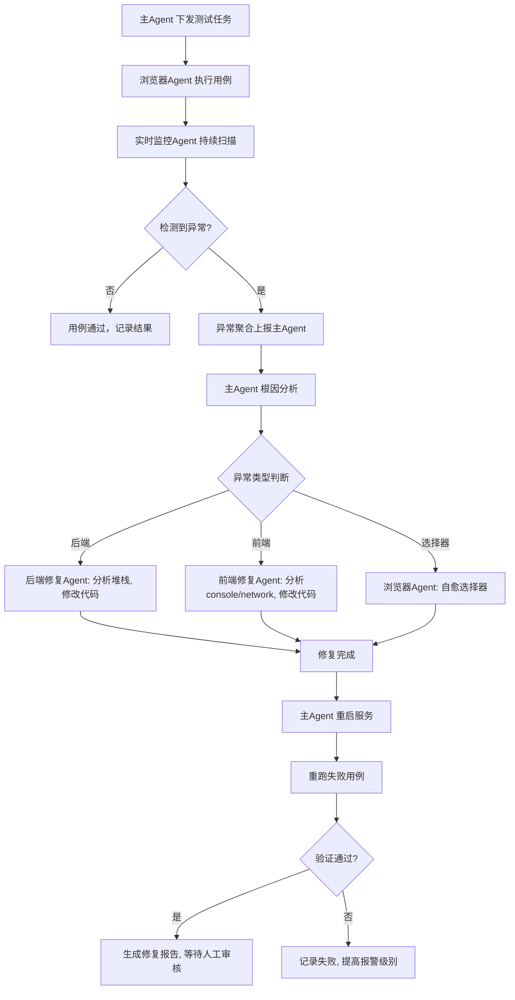

# 基于 Multica 的多 Agent 自动化测试与自愈系统方案设计

---

## 文档版本
| 版本 | 日期       | 作者        | 变更说明 |
| ---- | ---------- | ----------- | -------- |
| v1.0 | 2026-07-09 | AI 辅助设计 | 初始版本 |

---

## 1. 概述

### 1.1 项目背景
在软件持续交付过程中，自动化测试用例的执行、异常发现、根因定位及修复往往需要大量人工介入。为解决此痛点，本项目设计一套 **基于多 Agent 协作的自动化测试与自愈系统**，通过 Agent 技术实现测试执行、实时监控、智能诊断与自动修复的完整闭环。

### 1.2 设计目标
- **自动化测试执行**：无人工干预地运行端到端测试用例。
- **实时监控**：同时监控后端服务、前端页面及浏览器运行状态，捕获异常。
- **智能诊断**：聚合多源异常信息，快速定位问题根因（前端/后端/环境/测试脚本）。
- **自动修复**：针对常见问题（空指针、SQL错误、元素定位失效等）自动生成修复方案并验证。
- **自愈闭环**：修复后自动重启服务并重跑失败用例，确保回归通过。
- **轻量化部署**：最小化外部依赖，适应 Windows 开发环境，零侵入现有代码。

### 1.3 适用场景
- 微服务架构下的集成测试与回归测试
- 前端 UI 自动化测试（基于 Playwright）
- 开发自测阶段的问题快速响应
- CI/CD 流水线中的质量门禁（可扩展）

---

## 2. 功能需求

### 2.1 核心功能模块

| 模块                   | 功能描述                                                    |
| ---------------------- | ----------------------------------------------------------- |
| **测试用例管理**       | 支持测试用例的存储、版本管理、执行顺序编排                  |
| **后端服务控制**       | 以 Debug 模式启动/停止/重启 Java 后端服务，获取调试信息     |
| **后端日志监控**       | 零侵入式实时扫描服务日志（文件/控制台），捕获异常栈         |
| **前端服务控制**       | 以 Debug 模式启动/停止/重启前端服务（Vue/React）            |
| **前端日志监控**       | 通过 Chrome DevTools 协议获取浏览器 Console 和 Network 数据 |
| **浏览器自动化**       | 使用 Playwright 执行 UI 测试用例（点击、输入、断言）        |
| **异常聚合与根因分析** | 汇总各监控 Agent 上报的异常，利用 LLM 进行根因分析          |
| **自动代码修复**       | 针对后端 Java 代码或前端 JS/TS 代码生成修复补丁             |
| **测试脚本自愈**       | 修复断裂的元素定位器（Selector）                            |
| **服务重启与验证**     | 修复后自动重启服务，重跑失败用例，验证修复效果              |
| **报告生成与人工审核** | 生成修复报告（含修改代码、测试结果），提供审核界面          |

### 2.2 非功能需求
- **零侵入**：无需修改现有业务代码或测试代码。
- **Windows 原生支持**：所有组件在 Windows 10/11 上稳定运行。
- **低依赖**：除必需的 MCP 工具外，不引入 Redis、NATS 等中间件。
- **可扩展**：支持通过 Multica 动态注册新的 Agent Skill。
- **安全**：自动修复仅在独立分支进行，最终需人工确认合并。

---

## 3. 整体架构

### 3.1 架构图

```
┌─────────────────────────────────────────────────────────────────────────────┐
│                           Multica 主 Agent（Orchestrator）                  │
│  - 测试用例编排与调度                                                        │
│  - 异常汇总与根因分析（基于 LLM）                                            │
│  - 修复决策与分发                                                           │
│  - 服务重启与用例重跑控制                                                    │
│  - 报告生成                                                                 │
└─────────────────────────────────────────────────────────────────────────────┘
                                      │
                       Multica 内置通信（无需额外中间件）
                                      │
       ┌──────────────────────────────┼──────────────────────────────┐
       │                              │                              │
       ▼                              ▼                              ▼
┌───────────────────┐   ┌─────────────────────┐   ┌─────────────────────────┐
│ 后端监控与修复    │   │ 前端监控与修复      │   │ 浏览器自动化与测试      │
│      Agent        │   │      Agent          │   │       Agent             │
│                   │   │                     │   │                         │
│ - 启动/调试后端   │   │ - 启动/调试前端     │   │ - 执行 Playwright 用例  │
│ - 扫描日志文件    │   │ - 监控 Chrome       │   │ - 捕获元素定位异常      │
│ - 分析异常堆栈    │   │   Console/Network   │   │ - 自愈选择器            │
│ - 生成代码修复    │   │ - 分析 JS 错误      │   │ - 上报执行结果          │
│ - 重启 Windows    │   │ - 生成前端修复      │   │                         │
│   服务/进程       │   │ - 重启前端服务      │   │                         │
└───────────────────┘   └─────────────────────┘   └─────────────────────────┘
       │                              │                              │
       │                              │                              │
  ┌────▼────┐                   ┌─────▼─────┐                  ┌─────▼─────┐
  │ JetBrains│                   │ Chrome    │                  │ Playwright │
  │ MCP      │                   │ DevTools  │                  │ MCP        │
  │ Server   │                   │ MCP       │                  │            │
  └──────────┘                   └───────────┘                  └────────────┘
```

### 3.2 组件说明

| 组件                     | 职责                                                         |
| ------------------------ | ------------------------------------------------------------ |
| **Multica 主 Agent**     | 系统的“大脑”，负责任务编排、异常聚合、修复决策、流程控制。   |
| **后端监控与修复 Agent** | 通过 JetBrains MCP 与 IDE 交互，控制后端调试、读取日志、分析堆栈、修改代码。 |
| **前端监控与修复 Agent** | 通过 Chrome DevTools MCP 监控浏览器状态，分析前端错误，调用 LLM 修复代码。 |
| **浏览器自动化 Agent**   | 通过 Playwright MCP 执行 UI 测试，捕获测试失败信息，并尝试选择器自愈。 |
| **MCP 工具层**           | 标准化的 MCP 服务器，提供底层的 IDE 控制、浏览器控制、日志分析能力。 |

---

## 4. 各组件详细设计

### 4.1 Multica 主 Agent

#### 4.1.1 技术选型
- **框架**：Multica（开源多 Agent 管理平台），提供 Agent 生命周期管理、技能注册、任务分发、通信总线。
- **运行环境**：Windows 10/11 + Docker Desktop（Multica 后端依赖）。

#### 4.1.2 核心职责
1. **测试用例管理**：从本地或测试仓库加载测试用例列表（支持 JSON/YAML 格式）。
2. **任务编排**：按顺序或并行派发用例给浏览器自动化 Agent。
3. **异常收集**：接收所有子 Agent 上报的异常事件（含上下文信息）。
4. **根因分析**：调用 LLM（如 GPT-4、Claude）综合多源异常信息，定位根本原因。
5. **修复决策**：根据异常类型选择对应的修复 Agent（后端修复/前端修复/选择器修复）。
6. **流程控制**：协调“检测 → 分析 → 修复 → 重启 → 验证”闭环。
7. **报告生成**：汇总修复记录、修改 diff、验证结果，生成 Markdown/HTML 报告。

#### 4.1.3 工作流程伪代码
```python
# 主 Agent 核心逻辑（Multica Skill 形式）
class TestOrchestrator:
    def run(self, test_suite):
        for test_case in test_suite:
            # 1. 确保后端/前端服务健康
            self._ensure_services_healthy()
            # 2. 派发用例给浏览器 Agent
            result = self.browser_agent.execute(test_case)
            # 3. 收集所有子 Agent 的异常
            anomalies = self._collect_anomalies()
            if anomalies:
                # 4. 根因分析
                root_cause = self._analyze_root_cause(anomalies)
                # 5. 选择修复策略
                fix_agent = self._select_fix_agent(root_cause)
                # 6. 执行修复
                fix_result = fix_agent.fix(root_cause)
                if fix_result.success:
                    # 7. 重启服务
                    self._restart_services()
                    # 8. 重跑失败用例
                    self._rerun_failed_test(test_case)
                else:
                    self._report_failure(root_cause)
            else:
                self._mark_passed(test_case)
```

### 4.2 后端监控与修复 Agent

#### 4.2.1 功能分解
- **服务控制**：通过 Windows `sc` 命令或 `taskkill` + `start` 管理 Java 进程。
- **调试模式启动**：调用 JetBrains MCP 的 `debug_run` 能力，以 Debug 模式启动 Spring Boot 应用。
- **日志扫描**：使用 PowerShell `Get-Content -Wait` 或 Python `tailer` 读取日志文件，实时检测异常关键词（`Exception`、`Error`、`FATAL`）。
- **堆栈分析**：当检测到异常时，通过 JetBrains MCP 获取当前调用栈、变量值，作为 LLM 分析的上下文。
- **代码修复**：根据分析结果，使用 JetBrains MCP 的 `edit_file` 工具修改 Java 源码（如添加判空、修正 SQL），并触发重新编译。

#### 4.2.2 Windows 依赖
- `sc` 命令（管理 Windows 服务）或 `taskkill` / `start`（管理普通进程）
- JetBrains IDE（2025.2+）安装并启用 MCP Server 插件
- 日志文件路径需提前配置

#### 4.2.3 异常处理示例
| 异常特征                         | 检测方式        | 修复策略                                        |
| -------------------------------- | --------------- | ----------------------------------------------- |
| `NullPointerException` at line X | 堆栈定位        | 在该行前添加 `if (obj != null)` 或使用 Optional |
| `SQLException` (语法错误)        | 日志中 SQL 片段 | 使用 LLM 重写 SQL 或修正表名/字段名             |
| `OutOfMemoryError`               | 日志关键词      | 调整 JVM 参数（`-Xmx`）或排查内存泄漏点         |

### 4.3 前端监控与修复 Agent

#### 4.3.1 功能分解
- **前端服务控制**：以 Debug 模式启动前端开发服务器（如 `npm run serve -- --debug`）。
- **浏览器监控**：通过 Chrome DevTools MCP 连接已打开的 Chrome（需开启远程调试端口 9222），实时获取：
  - `console.log`、`console.error` 等信息
  - 网络请求（状态码、响应体）
  - 页面 DOM 结构（按需）
- **异常分析**：结合错误堆栈和源码映射（Source Map），定位前端代码错误位置。
- **代码修复**：修改 `.js`、`.ts`、`.vue` 文件，并触发热更新。

#### 4.3.2 Windows 启动 Chrome 调试
```powershell
start chrome.exe --remote-debugging-port=9222 --user-data-dir=C:\temp\chrome-debug
```
#### 4.3.3 监控工具
使用 Chrome DevTools MCP 提供的工具：
- `console_logs`：获取控制台输出
- `network_requests`：获取网络请求列表
- `evaluate_script`：在页面执行 JS 代码，获取额外信息

### 4.4 浏览器自动化与测试 Agent

#### 4.4.1 功能分解
- **测试执行**：通过 Playwright MCP 提供的 `browser_click`、`browser_fill`、`browser_snapshot` 等工具模拟用户操作。
- **结果判定**：基于断言（如元素可见性、文本内容）判定用例通过/失败。
- **选择器自愈**：当元素定位失败时，调用 Playwright MCP 的 `generate_selector` 或利用 LLM 根据页面快照重新生成选择器（参考 `playwright-ai-healer` 思路）。
- **异常上报**：将失败原因（超时、定位失败、断言不匹配）及页面截图/快照上报给主 Agent。

#### 4.4.2 自愈策略
| 失败类型       | 自愈操作                                             |
| -------------- | ---------------------------------------------------- |
| 元素未找到     | 获取页面可访问性快照，LLM 生成新选择器，更新测试脚本 |
| 页面加载超时   | 增加超时时间或检查网络/后端延迟                      |
| 断言文本不匹配 | 检查动态内容，可能为测试数据问题，记录并提醒人工     |

---

## 5. 工作流程详解

### 5.1 整体闭环流程



### 5.2 详细交互时序

1. **初始化阶段**  
   - Multica 启动，注册三个子 Agent（后端、前端、浏览器）。
   - 子 Agent 分别初始化 MCP 客户端连接（JetBrains MCP、Chrome DevTools MCP、Playwright MCP）。
   - 后端 Agent 确保后端服务以 Debug 模式启动，前端 Agent 启动前端 Debug 服务并打开调试 Chrome。

2. **测试执行阶段**  
   - 主 Agent 从测试仓库加载用例列表，逐个派发给浏览器 Agent。
   - 浏览器 Agent 执行用例，同时后端/前端监控 Agent 持续扫描日志和浏览器数据。
   - 每一步操作后，浏览器 Agent 检查页面状态，若失败立即上报。

3. **异常处理阶段**  
   - 任一监控 Agent 发现异常，格式化消息（含时间、堆栈、上下文）上报主 Agent。
   - 主 Agent 聚合可能来自多个源的异常，调用 LLM 进行联合分析。
   - 根据分析结果，主 Agent 指定修复 Agent 执行修复。

4. **修复与验证阶段**  
   - 修复 Agent 修改源码（需通过 Git 分支管理，生成 diff），触发重新编译/构建。
   - 主 Agent 通过 Windows 命令重启对应服务（或等待热更新生效）。
   - 主 Agent 重新执行失败的测试用例，确认修复效果。
   - 通过后，将修复 diff 和测试结果存入报告，并标记为“待人工审核”。

5. **报告与通知阶段**  
   - 所有用例执行完毕，主 Agent 生成完整的测试报告，包含通过/失败统计、修复详情、代码变更。
   - 可通过邮件或企业微信机器人通知开发人员审核修复内容。

---

## 6. 实施步骤

### 6.1 第一阶段：环境准备（1-2 天）

| 任务                          | 说明                                            |
| ----------------------------- | ----------------------------------------------- |
| 安装 Docker Desktop           | Windows 版，用于 Multica 后端                   |
| 安装 Multica                  | 执行 `irm https://multica.ai/install.ps1 | iex` |
| 安装 Node.js（LTS）           | 用于运行 MCP 工具                               |
| 安装 JetBrains IDE（2025.2+） | 并启用内置 MCP Server 插件                      |
| 安装 Playwright MCP           | `npm install -g @playwright/mcp`                |
| 安装 Chrome DevTools MCP      | `npm install -g chrome-devtools-mcp`            |
| 配置 Git Bash 作为默认终端    | 提高兼容性                                      |

### 6.2 第二阶段：核心能力验证（3-5 天）

- **验证后端调试**：通过 JetBrains MCP 连接 IDE，确认能启动 Debug 模式、读取变量、修改文件。
- **验证浏览器控制**：通过 Chrome DevTools MCP 连接 Chrome，确认能获取 console 和 network。
- **验证 Playwright 执行**：编写简单测试脚本，通过 Playwright MCP 执行并获取结果。
- **验证日志监控**：写简单脚本读取日志文件，模拟异常检测。

### 6.3 第三阶段：Agent 开发与集成（5-7 天）

- **编写 Multica Skills**：将后端、前端、浏览器功能封装为 Multica Skill（Python/Node.js）。
- **实现主 Agent 逻辑**：编写测试编排、异常聚合、根因分析（调用 LLM API）、修复调度。
- **集成自愈逻辑**：实现选择器自愈（基于 LLM 快照分析）和简单代码修复（基于规则+LLM）。
- **实现 Windows 服务管理**：使用 `sc` 或 `taskkill`/`start` 控制进程。

### 6.4 第四阶段：端到端联调与优化（5-7 天）

- 选择 1-2 个典型业务场景（含预期异常）进行全流程测试。
- 优化异常检测准确率（调整关键词、置信度阈值）。
- 优化修复成功率（细化修复模板，增加验证步骤）。
- 完善报告生成和审核界面（或集成到 Multica 内置 UI）。

### 6.5 第五阶段：试运行与迭代（持续）

- 在开发分支上试运行，收集修复案例。
- 建立修复数据库，用于后续微调 LLM 提示词或训练专用模型。
- 迭代添加更多异常类型及修复模板。

---

## 7. 技术栈与依赖清单

### 7.1 必需组件

| 名称                      | 版本    | 作用                                    |
| ------------------------- | ------- | --------------------------------------- |
| Multica                   | latest  | 多 Agent 管理框架                       |
| Docker Desktop            | 4.x     | Multica 后端运行环境                    |
| JetBrains IDEA / WebStorm | 2025.2+ | 提供 MCP Server，用于后端调试和代码编辑 |
| Node.js                   | 18+     | 运行 MCP 工具                           |
| Chrome                    | 最新    | 浏览器自动化目标                        |
| Git                       | 最新    | 版本控制，管理修复分支                  |

### 7.2 MCP 工具

| 名称                  | 安装命令                       | 说明                     |
| --------------------- | ------------------------------ | ------------------------ |
| `@playwright/mcp`     | `npm i -g @playwright/mcp`     | Playwright 浏览器自动化  |
| `chrome-devtools-mcp` | `npm i -g chrome-devtools-mcp` | Chrome DevTools 协议控制 |
| `@jetbrains/mcp`      | 内置 IDEA 插件                 | IDE 调试与文件操作       |

### 7.3 可选增强组件（按需引入）

| 名称                                     | 用途                               | 侵入性 |
| ---------------------------------------- | ---------------------------------- | ------ |
| `playwright-ai-healer`                   | 运行时选择器自愈（需 OpenAI 密钥） | 零侵入 |
| `Local Log & Observability Analyzer MCP` | 本地日志智能分析（无外部依赖）     | 零侵入 |
| `Multica` 内置 LLM 网关                  | 调用 OpenAI/Claude/本地模型        | 零侵入 |

### 7.4 依赖关系图

```
Multica (主框架)
  ├── Docker Desktop
  ├── 子 Agent (Python 脚本)
  │   ├── 后端 Agent → JetBrains MCP → JetBrains IDE
  │   ├── 前端 Agent → Chrome DevTools MCP → Chrome
  │   └── 浏览器 Agent → Playwright MCP
  └── LLM API (可选，用于根因分析和修复生成)
```

**本方案不引入 Redis、NATS、Elasticsearch 等额外中间件**，所有通信通过 Multica 内置总线或简单 HTTP 回调实现，最大程度降低运维成本。

---

## 8. 安全与审核机制

### 8.1 代码修改安全策略
- 所有修复操作在 **独立 Git 分支**（如 `fix/agent-xxx`）上进行。
- 修复后自动运行回归测试，通过后生成 Pull Request。
- 最终必须由 **人工开发者 Review** 后才可合并到主分支。

### 8.2 修复权限控制
- 可配置允许 Agent 自动修复的类型（如仅选择器修复，禁止修改业务逻辑）。
- 支持“只读模式”（仅报警，不自动修复）。

### 8.3 日志审计
- 所有 Agent 操作（读取日志、修改文件、重启服务）均记录详细日志。
- 日志可追溯，便于事后审计和问题排查。

---

## 9. 预期效果与风险应对

### 9.1 预期收益
- **测试维护成本降低 60%+**：自动修复断裂的选择器和常见代码问题。
- **问题响应时间缩短**：从发现到修复验证控制在分钟级。
- **提升回归测试效率**：减少人工排查和重复执行。

### 9.2 潜在风险及对策

| 风险                 | 对策                                             |
| -------------------- | ------------------------------------------------ |
| LLM 生成错误修复代码 | 增加静态分析校验，优先采用规则模板，加强人工审核 |
| Agent 误杀正常进程   | 加入服务健康预检，仅当异常明确且置信度高时干预   |
| Windows 环境不稳定   | 使用 `sc` 等成熟命令，增加重试机制和超时控制     |
| 多 Agent 日志冲突    | 统一日志格式，主 Agent 加锁处理异常汇总          |

---

## 10. 总结

本方案基于 **Multica 多 Agent 框架**，结合 **MCP 生态工具**（JetBrains MCP、Chrome DevTools MCP、Playwright MCP），构建了一套完整的自动化测试与自愈系统。系统支持 Windows 环境，零侵入现有代码，具备测试执行、实时监控、智能诊断、自动修复、服务重启和回归验证的全链条能力。通过将修复操作限制在独立分支并引入人工审核，确保了安全性和可控性。

该方案可有效降低测试维护成本，缩短问题反馈周期，是 DevOps 和 AI 辅助开发方向的一次有效实践。后续可根据实际业务场景，持续扩展异常类型库和修复模板，进一步提升系统的智能化水平。

---

**附录 A：Multica Skill 示例（Python）**
```python
# backend_monitor_skill.py
from multica import Skill

class BackendMonitorSkill(Skill):
    def __init__(self):
        super().__init__("backend-monitor")
    
    def on_event(self, event):
        if event.type == "scan_logs":
            anomalies = self.scan_logs(event.log_path)
            return {"anomalies": anomalies}
    
    def scan_logs(self, path):
        # 读取日志，检测异常
        pass
```

**附录 B：Windows 服务控制脚本**
```powershell
# restart-service.ps1
param($ServiceName)
Stop-Service $ServiceName -Force
Start-Service $ServiceName
```

---

